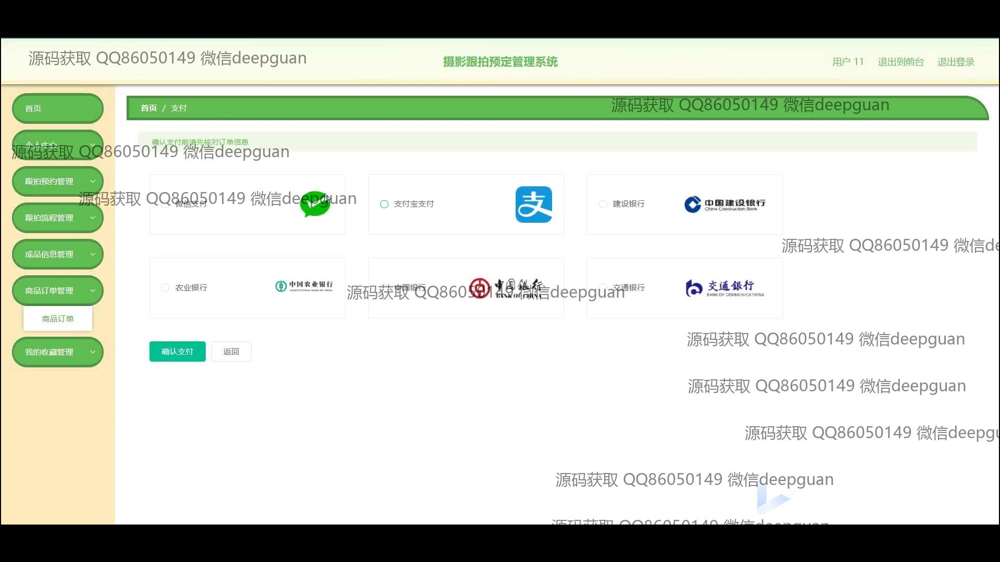
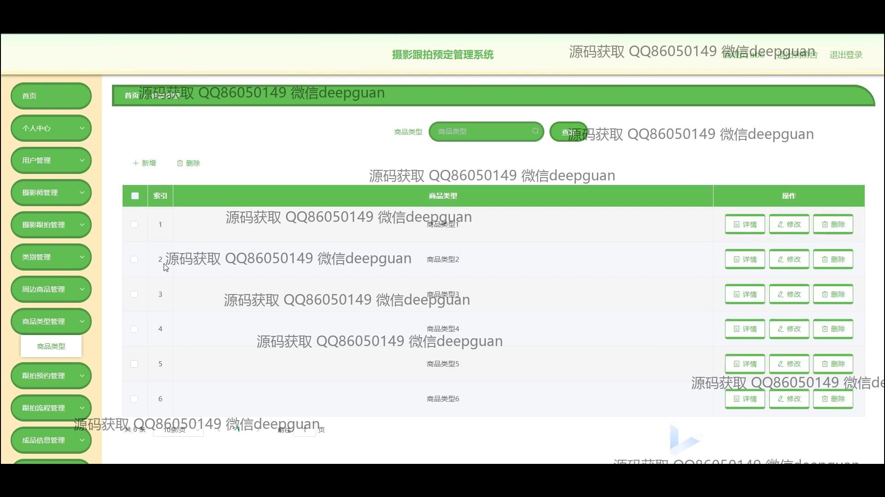

<h1 align="center">摄影跟拍预定管理系统</h1>

## 简介
摄影跟拍预定管理系统：角色分为管理员和用户；提供用户注册登录、摄影师管理、订单管理及评论功能，支持多种支付方式，方便用户预约摄影服务并管理个人信息，多功能模块提升系统操作效率。    --计算机毕业设计源码；毕设源码；java毕业设计源码

## 联系方式

<h3 align="center">获取完整代码与数据库文件 + 微信：deepguan QQ: 86050149 QQ群: 783742310</h3>

<h3 align="center">可帮忙远程部署 包运行成功！提供远程部署、修改代码、设计文档指导、代码讲解等服务！</h3>

## 功能介绍（完整见运行截图）
管理员：管理用户和摄影师信息，审核摄影预约和订单，并通过后台管理功能编辑和发布公告信息，处理商品和成品信息的管理和维护。摄影师管理模块便于上传作品和更新摄影师资料，类别管理和商品管理方便设置拍摄服务和相关产品。  
用户：注册登录系统后可以选择心仪的拍摄套餐，进行预约和支付。个人中心允许用户更新个人信息，查看和管理预约情况、订单记录和评论。用户可浏览摄影师列表及其作品、价格和评价，轻松选择并预约服务。此外，用户可以管理收藏的内容，针对拍摄效果发表评论并与摄影师互动。

## 运行截图

本代码来源于网络,仅供学习参考使用!

